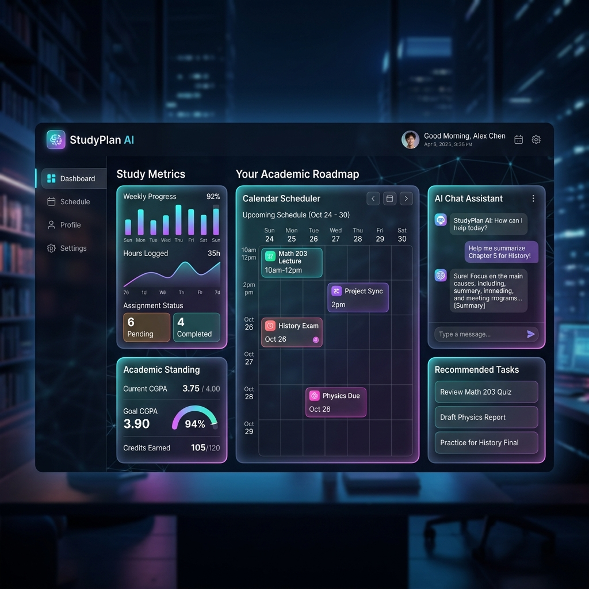

# StudyPlan AI | Your Intelligent Academic Concierge (Indian Version)

StudyPlan AI is a sleek, single-page application (SPA) dashboard designed to elevate students' academic study routines. Localized for the Indian academic system, this concierge utilizes a 10.0 CGPA scale, provides CBSE Board and B.Tech CSE level study guides, and includes an interactive AI chat assistant with integrated voice navigation.



## Key Workflows & Features

### 1. Indian Academic CGPA Tracker
- Standardized to a **10.0 CGPA scale** (replacing the standard 4.0 GPA scale).
- Seamless settings config matching Indian university grading requirements.

### 2. Intelligent Study Vault (Notes Processor)
- Upload notes (simulated parsing) or use preseeded Indian curriculum subjects:
  - **Class 10 Biology: Cell Division** (CBSE Syllabus)
  - **B.Tech CSE: Recursion & Big-O Complexity** (Data Structures and Algorithms)
  - **Class 12 History: Indian Freedom Struggle** (Detailed review of the Revolt of 1857, Non-Cooperation Movement, Dandi March, and Quit India Movement).
- Automatically generates **Simplified Content, Summaries, Key Concepts,** and **Revision Guides** using simulated AI.

### 3. Practice Engine (Flashcards & Quizzes)
- Test knowledge retention with flashcards.
- Take dynamic multiple-choice quizzes preseeded with Indian history, CBSE biology, and B.Tech computer science questions.
- Review and trace score progression curves on the goals panel.

### 4. Academic Planner & Tasks
- Kanban board for project and homework tracking.
- Calendar monthly grid with automated prep buffers scheduled 2 days before exams.

### 5. AI Chat Assistant & Voice Commands
- Interactive Chatbot featuring speech synthesis and voice command recognition.
- Navigation voice shortcuts (e.g., "go to planner", "start timer") to navigate between dashboard views hands-free.

### 6. Recommended Learning Resources
- Provides Indian education channels and links, including **Physics Wallah, NPTEL Lectures, GeeksforGeeks, NCERT portals, and StudyIQ IAS**.

## Tech Stack
- **Structure**: Semantic HTML5 (Single Page Application routing via hash-less view swapping)
- **Styling**: Modern CSS3 (Variables, Dark-mode first theme, Glassmorphism, animations)
- **Logic**: Vanilla ES6 JavaScript (LocalStorage state management, drag-and-drop API)
- **APIs**: Web Speech Recognition API (Speech-to-text navigation)
- **Icons**: Lucide Icons library

## Quick Start
To run this project locally:
1. Clone the repository:
   ```bash
   git clone <repository_url>
   ```
2. Navigate to the project directory and host a local server. For example, using Python:
   ```bash
   python -m http.server 8082
   ```
3. Open `http://localhost:8082` in your web browser.
4. **Log in** with the demo credentials:
   - **Email:** `renuka@nitk.edu.in`
   - **Password:** `password123`
