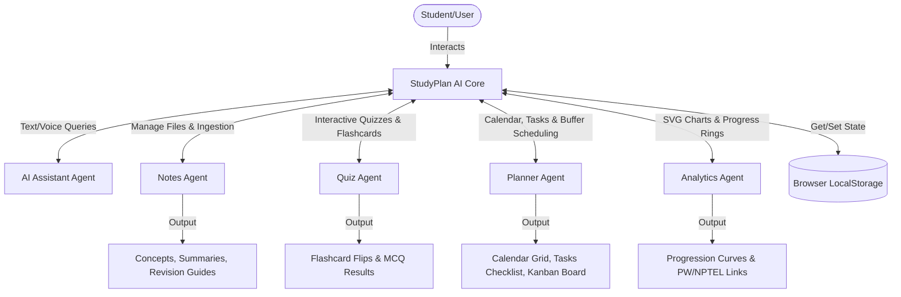
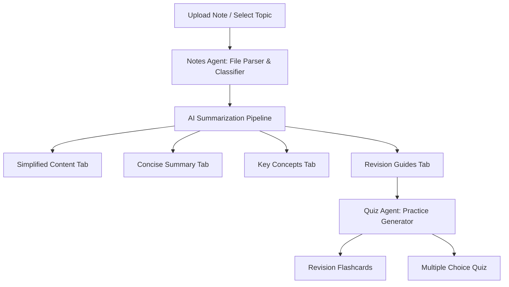
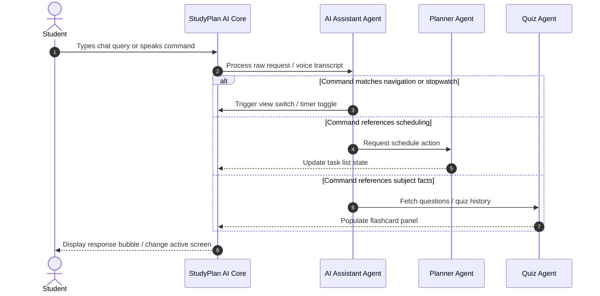
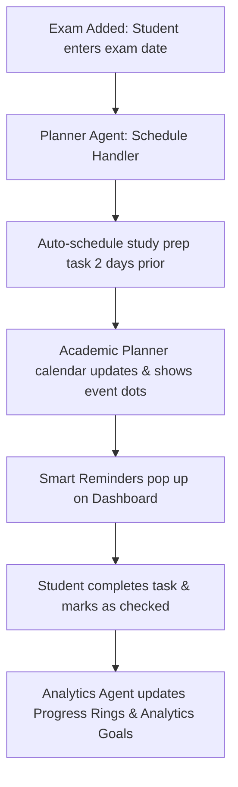

# StudyPlan AI | Your Intelligent Academic Concierge

[](https://github.com/RenukaJyothiS/StudyPlan-AI)
[](https://github.com/RenukaJyothiS/StudyPlan-AI)
[](https://github.com/RenukaJyothiS/StudyPlan-AI)
[](https://github.com/RenukaJyothiS/StudyPlan-AI)
[](https://github.com/RenukaJyothiS/StudyPlan-AI)

> **Simplify Notes • Generate Quizzes • Plan Smarter**

---

## 📌 Project Overview
**StudyPlan AI** is a sleek, single-page intelligent dashboard designed to streamline study routines, minimize cognitive load, and optimize exam preparation. Tailored for the Indian academic system, the app consolidates fragmented student workflows—such as reading lecture notes, scheduling, taking practice quizzes, and tracking study metrics—into a unified, highly interactive academic cockpit. 

---

## ❓ Problem Statement
Students face an overwhelming amount of information across multiple subjects, coupled with disjointed study methods. To prepare for exams, they typically jump between text readers, reminder applications, task boards, and mock testing sites. This context-switching:
- Disrupts deep focus (cognitive cost).
- Results in poor tracking of study hours and recall performance.
- Limits the effectiveness of active recall (flashcards/quizzes) and spaced repetition due to manual scheduling friction.

---

## 💡 Solution Overview
StudyPlan AI introduces an **agentic study dashboard** that automates the transition from note consumption to recall testing and scheduling. By entering a single localized workspace, students can upload notes, view auto-summarized study points, test themselves instantly via AI-generated quizzes, check calendar slots featuring auto-scheduled prep buffers, and navigate using integrated voice commands.

---

## 🤖 Why Agents?
Traditional applications rely on rigid, hardcoded monolithic architectures where features share state and control flows sequentially. By shifting to a **Multi-Agent Architecture**, StudyPlan AI models individual concerns as autonomous, specialized entities:
- **Separation of Concerns**: Each agent operates independently (e.g., the Quiz Agent governs the testing loop, while the Notes Agent oversees text processing). If one component changes, it does not cascade bugs into the rest of the application.
- **Autonomous Action**: The Planner Agent operates proactively—not just reacting to user clicks, but automatically creating preparatory study tasks 2 days prior to any added exam date.
- **Context-Specific Interaction**: The AI Assistant Agent coordinates with other agents to retrieve localized user context (such as active study material and target CGPA) to generate highly personalized study strategies.
- **Scalability**: New specialized agents (e.g., a collaborative group agent or a syllabus-scraping agent) can be introduced with minimal modifications to the core interface.

---

## 🏗️ Agent Architecture

StudyPlan AI is powered by five specialized, cooperative agents that handle specific user workflows:

```
                  ┌─────────────────────────────────────────┐
                  │          STUDYPLAN AI CORE              │
                  └──────────────────┬──────────────────────┘
                                     │
         ┌───────────────┬───────────┼───────────┬───────────────┐
         ▼               ▼           ▼           ▼               ▼
  ┌─────────────┐ ┌─────────────┐ ┌─────────────┐ ┌─────────────┐ ┌─────────────┐
  │ Notes Agent │ │ Quiz Agent  │ │Planner Agent│ │Analytics Agt│ │AI Asst Agent│
  └─────────────┘ └─────────────┘ └─────────────┘ └─────────────┘ └─────────────┘
```

1. **Notes Agent** (`notesProcessor.js`):
   - **Purpose**: Manages file parsing and material ingestion. It analyzes text, classifies it under specific subjects, and structures the output into four study formats: *Simplified Breakdown, Concise Summary, Key Definitions,* and *Active Recall Revision Cues*.
2. **Quiz Agent** (`quizFlashcards.js`):
   - **Purpose**: Ingests notes metadata and dynamically builds practice assessments. It organizes flashcard lists, runs multiple-choice quiz logic (correct/incorrect answer highlighting), computes percentage scores, and logs results to local history.
3. **Planner Agent** (`studySchedule.js`):
   - **Purpose**: Governs the academic schedule. It maps out a 6-row calendar month grid, administers the Kanban board task flows, and executes the **2-day exam prep buffer automation**.
4. **Analytics Agent** (`analytics.js` & `projectsGoals.js`):
   - **Purpose**: Oversees performance mapping. It calculates progress metrics, draws programmatic SVG charts (Weekly study distribution and quiz score progression curves), and suggests online resources matching the active subject.
5. **AI Assistant Agent** (`chatAgent.js`):
   - **Purpose**: Powers the concierge chatbot and voice interaction. It matches user query intents, provides contextual answers based on active notes, and manages the **Web Speech Recognition API** to trigger SPA view switches or stopwatch controls.

---

## 📊 System Workflows & Architecture Diagrams

### 1. High-Level System Architecture
This diagram outlines how user input is captured, distributed to the autonomous agents, and saved locally to the browser's persistent store.


* **Architecture Explanation**: The StudyPlan AI Core interface coordinates user input and routes actions to the respective agent. The agents execute their single-responsibility loops, sync state with the core coordinator, and persist data in `LocalStorage` to maintain session integrity across reloads.

---

### 2. Notes Processing Workflow
This workflow displays how a note file is parsed, organized into study tabs, and transformed into practice materials.


* **Workflow Explanation**: Once a note is uploaded or chosen, the **Notes Agent** parses the text and classifies it. It segments the concepts into tabs in the Study Vault view. The **Quiz Agent** then inherits this context, automatically loading corresponding flashcards and quizzes for student self-testing.

---

### 3. Agent Interaction Workflow
This sequence diagram shows the communication flow between the Core App, the AI Assistant, and specialized agents during query execution.


* **Workflow Explanation**: When a user inputs a query or command, the **AI Assistant Agent** processes the input. It determines the user's intent and delegates execution to the **Planner Agent** or **Quiz Agent**, or switches the dashboard views directly in the Core coordinator.

---

### 4. Academic Planner Workflow
This diagram illustrates the automated scheduling workflow triggered by adding an upcoming exam.


* **Workflow Explanation**: When a student schedules an upcoming exam, the **Planner Agent** proactively schedules a study task 2 days prior to the exam date. The calendar is updated, and a dashboard alert is registered. Once completed by the user, the **Analytics Agent** calculates the completion percentage and updates the goals interface.

---

## 🌟 Key Features

- **Double-Digit Indian CGPA Scale**: Fully adapted to a **10.0 CGPA system** (replacing the traditional 4.0 GPA scale) with adjustable target CGPAs.
- **Indian Curriculum Ingestion**: Preseeded notes, flashcards, and quizzes for:
  - **Class 10 Biology: Cell Division** (Mitosis, Meiosis, PMAT).
  - **B.Tech CSE: Recursion & Big-O** (Stack overflow, call stack, binary search).
  - **Class 12 History: Indian Freedom Struggle** (Sepoy Mutiny 1857, Non-Cooperation 1920, Dandi March 1930, Quit India 1942).
- **Proactive Scheduling (2-Day Buffer)**: Automatically schedules a study preparation session 2 days before any exam event.
- **Integrated Voice Control**: Built-in voice commands via the **Web Speech Recognition API** to toggle study timers, open panels, or add tasks hands-free.
- **Visual Analytics**: Interactive, lightweight SVG charts mapping daily study hour distributions and quiz score progression.
- **Curated Educational Resources**: Matches the active study topic to recommendations from **Physics Wallah, BYJU'S, GeeksforGeeks, StudyIQ IAS, and NPTEL Lectures (IITs)**.

---

## 💻 Tech Stack
- **Architecture**: Single Page Application (SPA) routing via hash-less view swapping.
- **Structure**: Semantic HTML5.
- **Styling**: Modern CSS3 (Variables, dark-mode first design system, Glassmorphism, animations).
- **Logic**: Vanilla ES6 JavaScript (LocalStorage state management, HTML5 Drag-and-Drop API).
- **APIs**: Native Web Speech Recognition API (for voice navigation).
- **Icons**: Lucide Icons CDN.

---

## 🚀 Setup Instructions

Follow these steps to host StudyPlan AI locally:

1. **Clone the repository**:
   ```bash
   git clone https://github.com/RenukaJyothiS/StudyPlan-AI.git
   ```
2. **Navigate to the project folder**:
   ```bash
   cd StudyPlan-AI
   ```
3. **Launch a local server**:
   Since the app is pure HTML/CSS/JS, you can run a simple server (e.g. using Python):
   ```bash
   python -m http.server 8082
   ```
4. **Access the application**:
   Open your browser and navigate to `http://localhost:8082`.
5. **Testing & Demo Credentials**:
   - *Note: Demo credentials are available for testing purposes on the sign-in panel (no signup required).*
   - Use the preloaded credentials listed at the bottom of the sign-in card to view the localized dashboard.

---

## 📂 Project Structure

```
StudyPlan-AI/
│
├── index.html                 # Main dashboard markup (SPA layout)
├── style.css                  # Core CSS variables, typography, and styling
├── app.js                     # Global app initializer & SPA view controller
├── auth.js                    # Auth Agent (User profile, settings, CGPA goals)
├── notesProcessor.js          # Notes Agent (Preseeded notes & simulated AI parsing)
├── quizFlashcards.js          # Quiz Agent (Flashcard flips & MCQ testing logic)
├── studySchedule.js          # Planner Agent (Calendar grid & prep buffers)
├── projectsGoals.js           # Planner Agent (Kanban board & task lists)
├── analytics.js               # Analytics Agent (SVG chart rendering & link recommendations)
├── chatAgent.js               # AI Assistant Agent (Voice commands & chat matching)
│
├── studyplan_ai_dashboard.png # High-fidelity dashboard UI mockup
├── project.md                 # System flow diagrams documentation
└── README.md                  # Kaggle Capstone Project documentation
```

---

## 📈 Project Impact
StudyPlan AI addresses student burn-out and focus fragmentation. By unifying review notes and recall quizzes, students spend less time configuring study parameters and more time actively learning. Localizing the dashboard to the Indian curriculum and CGPA standards makes the tool immediately useful for students preparing for CBSE Board Exams or pursuing undergraduate B.Tech programs.

---

## 🔮 Future Enhancements
- **Multi-student Group Agent**: Enabling peers to sync calendar events and share custom notes.
- **External Syllabus API Scraper**: Integrating with university portals to auto-pull exam date sheet calendars.
- **Active Recall Spaced Repetition (Anki Algorithm)**: Implementing an advanced spaced repetition algorithm to schedule quiz intervals dynamically.

---

## 📄 License
This project is licensed under the MIT License - see the LICENSE file for details.
