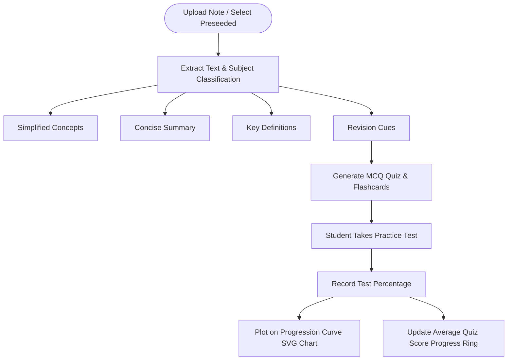
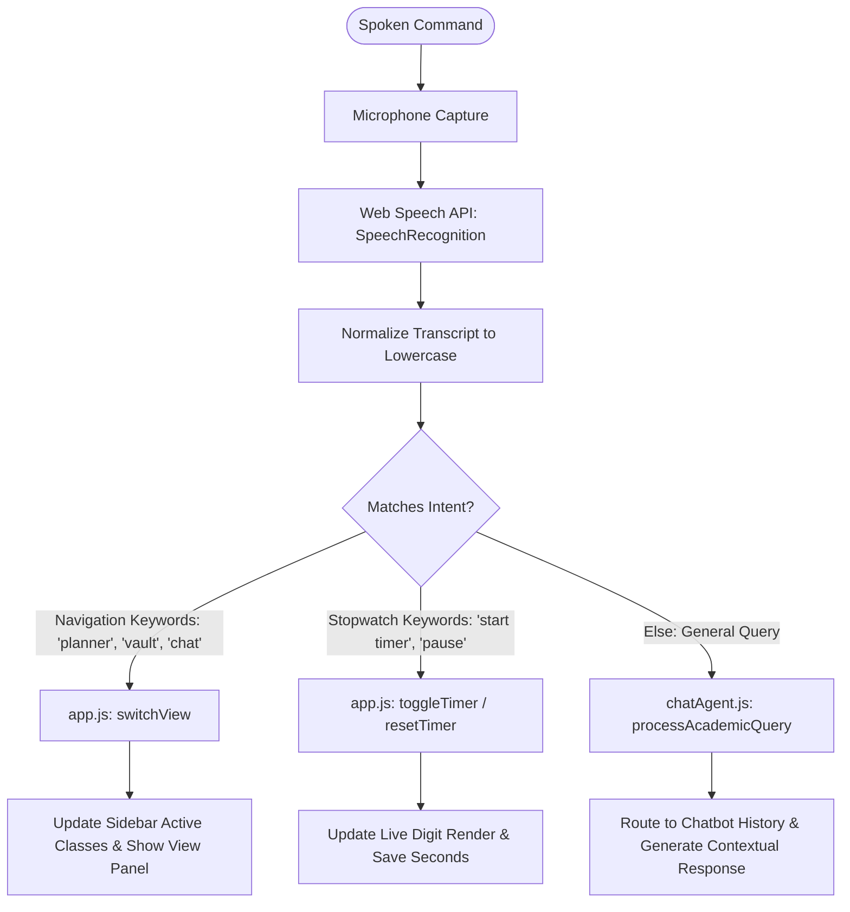

# StudyPlan AI: Technical Architecture & System Workflows

StudyPlan AI is an intelligent academic concierge designed to optimize study routines for Indian students. It acts as a single-page application (SPA) dashboard that bridges study materials, active recall assessments, calendar planning, goals analytics, and voice-controlled interaction.

---

## 1. High-Level System Architecture

The diagram below maps out how student inputs (files, text queries, voice instructions) are captured by the StudyPlan AI subsystems, coordinated by the main application layer, and persisted locally.

```mermaid
graph TD
    User([Student]) -->|Interacts| UI[HTML5/CSS3 Interface]
    
    %% Inputs
    UI -->|Notes/Text Upload| NP[Notes Processor]
    UI -->|Interactive Inputs| PE[Practice & Quiz Engine]
    UI -->|Schedule Events/Tasks| AP[Academic Planner]
    UI -->|Text Chat & Voice| CA[AI Chat & Voice Agent]
    
    %% Coordination & State
    NP <-->|Sync State| AC[App Coordinator: app.js]
    PE <-->|Sync State| AC
    AP <-->|Sync State| AC
    CA <-->|Sync State| AC
    
    %% Local Storage Persistence
    AC <-->|Get/Set state| LS[(Browser LocalStorage)]
    
    %% Resource / Chart Rendering
    AC -->|Render SVG Curves| AN[Goals & Analytics]
    AN -->|Fetch recommendations| LocalDB[(Indian Learning Resources: NPTEL, PW, GFG)]
```

---

## 2. Notes to Practice & Analytics Workflow

This flowchart illustrates the lifecycle of a study document, from initial upload to AI summarization, test generation, and performance tracking.

---

## 3. Voice Command & Navigation Engine

This diagram demonstrates how verbal instructions are captured using the Web Speech API, matched against system intents, and converted to SPA view changes or timer operations.

---

## 4. Subsystem Details

### 🔑 Authentication & Profiles (`auth.js`)
- Sets up standard user profiles (e.g. **Renuka Jyothi**, major in **B.Tech CSE**) with local database persistence.
- Handles authorization redirects and updates dashboard components.
- Manages the **10.0 CGPA Scale** target preferences and synchronization.

### 📚 Study Vault & Notes Processor (`notesProcessor.js`)
- Manages note files and processes raw strings into academic summaries.
- Injects simulated AI-processed content layouts directly into the DOM based on selected subjects.

### ✏️ Practice & Flashcards (`quizFlashcards.js`)
- Seeds flashcards and quizzes for specialized topics (Cell Division, DSA, and Indian Freedom Struggle).
- Computes test scores, delivers active-recall prompt feedbacks, and logs percentage trends.

### 📅 Academic Planner & Scheduler (`studySchedule.js`)
- Orchestrates a 6-row calendar month matrix.
- Automates exam preparation: **when you add an exam, the AI automatically schedules a study buffer task 2 days prior to the test date**.
- Employs HTML5 drag-and-drop actions on the Kanban board to track assignment states.

### 📊 Goals & Analytics (`analytics.js`)
- Renders lightweight SVG charts programmatically, plotting weekly study hours and quiz score growth.
- Suggests online study recommendations matching the active subject.
